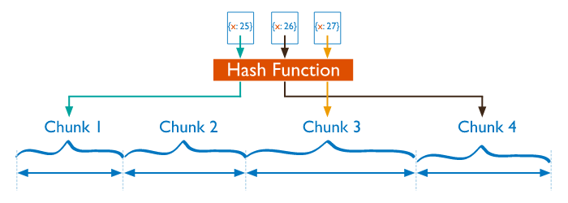

# readme

# Today I Learned (TIL)

매일 무엇을 배웠는지 정리하고 기록합니다.

> 꾸준히 하면 좋은 일이 생긴다!

### History

- [2019년 10월](https://github.com/jhleed/TIL#2019%EB%85%84-10%EC%9B%94)
- [2018년 10월](https://github.com/jhleed/TIL#2018%EB%85%84-10%EC%9B%94)
- [2018년 9월](https://github.com/jhleed/TIL#2018%EB%85%84-9%EC%9B%94)
- [2017년 10월](https://github.com/jhleed/TIL#2017%EB%85%84-10%EC%9B%94)
- [2017년 9월](https://github.com/jhleed/TIL#2017%EB%85%84-09%EC%9B%94)
- [2017년 8월](https://github.com/jhleed/TIL#2017%EB%85%84-08%EC%9B%94)

## 2019년 10월

### ~19.10.07

1년만에 TIL을 쓴다. 배움에 대한 기록은 `Notion`에 지나칠 꾸준히 하고 있지만 전부 Private라서 다른 곳에 공개되지 않는다. 타인이 볼 수 있도록 글을 쓰게 되면 좀 더 기록이 꼼꼼해지지 않을까 싶어서 다시 Github에 TIL 기록을 남기기로 한다.

에디터로 어떤 것을 쓸 지가 고민이다. (벌써?) 텍스트만 올리려면 그냥 아무 에디터나 쓰면 그만이지만, 이미지를 자주 쓰는 나의 특성상 매번 이미지 파일을 다운로드 받고, 경로를 지정해주는 일은 너무나도 귀찮기 때문. 귀찮은건 질색.

애정하는 `Notion`에서 바로 요 TIL Repository로 업로드를 할 수 있으면 좋겠다. Notion에서 Export까지만 수동으로 해주고 해당 경로에서 이미지를 한꺼번에 옮긴 다음에 TIL Repository로 Push를 해주는 스크립트를 짜볼까 한다.

**MongoDB**

샤드키의 앞자리, 뒷자리 중 어느 것이 영향을 더 많이 미치는지를 알아봐야 한다. 시원하게 정리된 자료가 없어서 [몽고디비 공식 Doc](https://docs.mongodb.com/manual/core/hashed-sharding/)을 참고해서 보고 있다.

## 2018년 10월

### ~18.10.28

- 선기형과 빅데이터 플랫폼 스터디 결성
    - 아직 자세한 계획은 없지만.. 선기형은 `ELK` & `Kafka`, 나는 `Hadoop Ecosystem` & `Kafka`
    - 드디어 나도 내가 필요한 부분을 함께 공부할 동지가 생겼다!
- 글또 시작
    - 11월 17일에 첫 모임이 예정되어 있다.
    - 학생분들도 많고, 네임드 서비스를 운영하는 회사에서 오신 분들도 많다.
    - 데이터에 관심을 가지신 분들이 많은 것 같은데 좋은 자극 받아가야겠다.
- Kafka` 개념을 학습
    - 카프카 looks like 실시간 데이터 스트리밍 플랫폼
    - 11번가에서 실제로 카프카를 사용하고 있는 사례, 11번가는 에어비엔비, 넷플릭스 등을 참고하였음
    - MSA와 카프카의 조합, 카프카를 backbone으로 사용하고 각 서비스들은 카프카를 이용하여 느슨하게 통신한다.
        - 특정 서비스가 장애가 발생해도, 전체 장애로 퍼지는 것을 방지한다.
            - 이 부분은 카프카가 있어서 장애 전파 방지가 된다기 보다는.. 카프카를 이용함으로 이러한 장애 전파 방지 처리가 더 쉬워졌다는 의미인 것 같다. (어차피 서비스 죽으면 response가 없을 것이기 때문에..)
        - 서비스 장애가 복구가 되면 카프카에 모아두었던 request들을 다시 전송한다.
            - kafka가 데이터를 디스크에 안정적으로 저장하기 때문에 이런 것이 가능
            - 이건 꽤 좋은 것 같다.
- ELK 개념을 학습하였음
    - 희끄무레하게 알고 있던 것을 정의와 사용처를 명확하게 하니 좋았다.

### ~18.10.26

~~여기서부터는 작성 편의상 음슴체로 다시 회귀하였습니다.~~

- 광고 리포트 Batch Job에 테스트 코드를 적용하고, DB와의 의존성 분리에 성공

    (한 것 같다)

- 100% 커버리지는 아니지만 에러 포인트를 잡아내는 것이 그 전에 비해 훨씬 수월해졌다. 야호.
    - ~~불안정한 Apache kylin…후.~~~
- 광고 리포트 시스템에 테스트를 작성하기까지의 고민과 그 과정들은 TIL에 담기에는 너무 길어서 별도의 글로 정리해야겠다.

## 2018년 9월

### 18.09.29

- 이베이에 온 뒤로는 `.NET` 환경에서만 개발해서 복습도 할 겸 오랜만에 `Spring Boot` 와 `JPA`를 써서 간단한 API 서버를 만들어 보았습니다. 오랜만에 사용해보니 생각보다 삽질을 많이 했습니다.
- `Testing`에 대한 고민 - DB와의 의존성을 느슨하기 위한 방법들에 대한 고민
    - Repository단에서는 실제 Connection을 사용, 비즈니스 로직 단계에서는 `Mocking` 을 사용해볼까?
        - Repository 단에서 실제로 값을 받아오는 것을 검증하는 단위 테스트를 작성
        - Repository 단위 테스트를 믿고, 비즈니스 로직에서는 `Mocking` 사용
    - 테스트를 위한 별도의 스키마를 생성하는 방법도 고려해봤지만 그다지 좋은 솔루션은 아닌 듯
        - 테이블 변경/추가 시 2벌씩 해야 하기 때문..
- 테스트의 가독성을 좀 더 좋게 하도록 `BDD` 고려 - `Spock` 라이브러리
- 그 외
    - 머신러닝, Redis를 공부하려고 했는데 API 만드는 부분이 테스팅이 너무 재밌다 보니 온종일 저것들만 만들었다..
    - 재밌는 공부, 중요한 공부 사이의 저울질이 어렵다. ### ~ 18.09.28
- ~~개인적으로 진행하는 프로젝트에 `MSA` 를 적용하고 있습니다. 사실 `MSA`라고 부르기 민망할 정도의 작은 모듈들의 집합이긴 합니다.~~
    - ~~이런 작은 규모에도 `MSA`를 적용하는 이유는 아래와 같습니다.~~
        - ~~경험~~
        - ~~추후 다른 개인 프로젝트에서 해당 모듈들을 재활용하기 위함~~
    - MSA 적용 후기 : 결국 생산성 문제로 모놀리틱 구조로 회귀하였습니다. 그냥 서비스를 개발하고 추후에 API를 분리하는 것이 더 이득일거라는 생각이 드네요.
- 현재 Account / Board 기능들을 구현 중에 있습니다.
    - 추후 더 적용해볼 만한 기능들이 생각나면 좋을 텐데 잘 떠오르지 않네요.
- 적용된 기술 스택은 `NodeJs`/`Spring Boot`/`ORM` /`VUE.js`/`AWS - EC2` /`REDIS` 입니다. ### 2018.01 ~ 2018.09

`Today I Learned`를 거의 1년 만에 다시 시작합니다.

8개월 동안 새로운 환경에서 여러 가지로 많이 배우며 도전했습니다.

입사 초반에는 정말 새로운 환경에서 배울 게 너무 많아 매일매일 한계까지 짜내어지는 기분이었습니다. (개인 노트에 적기도 바빠서 TIL에 따로 정리해서 기록하지 못했다는 핑계를)

처음 맡은 프로젝트에 극한의 일정과 범위가 할당되었습니다.

회사에서도 야근을 지양하는 분위기고, 개인적으로도 야근을 좋아하는 성격은 아니지만 주어진 일정 내에 맡은 일을 반드시 처리해야 한다는 책임감(~~부담감~~) 때문에 처음으로 주말 출근과 휴일 출근을 반복적으로 하는 경험도 했습니다. (한 달 반 정도?)

시간과 품질 사이에서 정말 많은 고민과 갈등을 겪었고 심신도 많이 피곤했지만 **프로젝트는 결국 런칭에 성공했습니다. 정말 뿌듯했습니다.**

지금은 예전부터 도전하고 싶었던 빅 데이터(`Hadoop Ecosystem`) 쪽을 맡게 되어 한창 공부하고 적용하고 있습니다.

- 개인적으로는 인공지능 - `Machine Learning` 쪽을 꽤 재밌게 공부하고 있습니다. 이 분야도 꼭 실무를 경험하고 싶습니다)

요약하면 아래와 같습니다.

- **Business**
    - 광고 플랫폼 - 매력적인 도메인
- **Technology**
    - `Linux` & `Spring` 기반에서 `Window` &amp`.NET Framework`로 전환
    - 빅 데이터 핸들링 - `Hadoop Ecosystem` & `Lambda Architecture`
    - 인공지능 - `Machine Learning` - 아직 실무 X, 개인적으로 공부 중
- **Projects**
    - 새로운 광고 플랫폼 개발 및 런칭 (OBT)
        - 담당 파트 : Account / Report
    - 기존 광고 시스템 유지보수
        - 일 매출 억 단위 유지 중

## 2017년 10월

### ~ 17.10.26

- `신림 프로그래머` 스터디 그룹에서 `Java9`와 `Spring5`를 공부하였고 [회고록](https://github.com/jhleed/study-java9-and-spring5)을 작성하였습니다.
    - [Reactive Programming with JDK 9 Flow API](http://jhleed.tistory.com/99)문서도 번역해 보았습니다.
- 별 생각없이 쓰고 있던 `Logging`에 대해서 왜 쓰는지, 어떤 것이 좋은지를 생각해보는 시간을 가졌습니다.
- `System.out.println`을 썼을때의 단점과 로깅 라이브러리인 `log4j` 여기서 더 진보한 `logback`과 로깅 라이브러리들을 쉽게 갈아끼우기 위한 (파사드, facade 패턴) `slf4j` 등..
- 처음으로 외주를 시작하였습니다. 그리고 개인적으로 좋은 팀도 생겼습니다. 금액이 많고 적고를 떠나서 회사에서 주는 월급 외의 나의 능력으로 버는 수입이 추가되었다는 것에 의미를 두어보려고 합니다.

### ~ 17.10.17

- REST API를 RESTful하게 쓰고 있는가에 대하여 반성하게 하는 글을 보았습니다. [그런 REST API로 괜찮은가](http://slides.com/eungjun/rest#/)
- 요점은 로이 필딩이 제시한 REST한 조건을 만족시켜서 제대로 RESTful한 API를 만들던지 혹은 API의 이름을 바꾸라는 것입니다. (HTTP API? Web API?)
- 여유롭지 않은 재정상황이었지만 아이패드 + 애플펜슬 세트를 구매하였습니다. 생산성을 올리는 일에는 아낌없이 투자하려고 합니다.

### 17.09.22

**Java** - `Annotation`의 사용법을 복습하였고 사용 이유에 대해서 다시 한번 생각해보았습니다. - `Annotation`, `Reflection`과 같이 사용법은 알지만 근본적인 존재 이유를 모르고 사용하는 기술들이 있습니다. 이런 기술들은 안다고 할 수 없기에 지속적인 학습이 필요하다고 생각합니다.

**input tag file copy** - 하나의 `<input type=file>` 에서 다른 `<input type=file>`으로 파일을 복사하려면 아래처럼 간단한 코드로 처리가 가능합니다. **동료의 시간을 아껴줄 수 있어서 좋았습니다.**

    //btn1에 파일을 올리면 btn2로 복사.
     $("#btn1").on("change", function () {
        $("#btn2")[0].files = this.files;
    });

---

### 17.09.21

**Github** - [TIL Repository](https://github.com/jhleed/TIL)를 정리하였습니다.

**IntelliJ** - 서브모듈을 구성하는 방법에 대해서 고민을 하였습니다.

---

### 17.09.20

**Python 보다는 Js를** - 최근 자바를 이용하여 코딩 테스트를 연습하던 도중 자바를 대체할 언어를 찾았습니다. 동료인 태환님은 `Python`으로 알고리즘을 푸는데 간결한 문법이 매우 좋다고 하였습니다. - 저도 `Python`을 고민하다가 결국 `Javascript`로 가기로 하였습니다. `Javascript`는 이미 쓰고있는 언어이기 때문에 별도의 학습 비용이 필요 없고 어느정도 간결하기 때문입니다.

**AWS** - Awsomeday를 다녀온 뒤 회사에서 브리핑을 하기로 하여 관련 기술 몇 가지를 복습하였습니다. - AWS 보안 및 접근제어 관리 서비스 - IAM - AWS의 관리형 서비스 및 데이터베이스 서비스 - RDS ,DynamoDB - 확장성 있는 아키텍처 구축을 위한 AWS 서비스

**IntelliJ** - [Module 끼리 Grouping 을 하는 방법](https://www.jetbrains.com/help/idea/grouping-modules.html)을 찾아내었습니다. 덕분에 프로젝트 구성을 좀 더 가독성 있게 구성 할 수 있게 되었습니다.

**Github** - 학습하는 기술에 대해서 별도의 리파지토리를 운영하고 있습니다. - 리파지토리의 이름은 study-XX 의 형태를 가지고 있습니다. (ex : study-nodes, study-polymer) - 이것을 그냥 study 라는 리파지토리 내에 하나로 합쳐버리면 어떨까 싶습니다.

---

### 17.09.13

**MongoDB**

- `Replica Set`과 `Spring Boot`의 연동이 드디어 끝났습니다. MongoDB Instance에서 Replica Set을 설정해줄때 IP를 AWS의 `Public DNS (IPv4)`에 연결해 줘야 합니다.
- 처음에 이 작업을 시작할때는 이정도 디비 세팅정도 책보고 하면 금방 하겠지 했는데, 예상외의 변수가 계속 생겨서 시간이 굉장히 지체되었습니다. (네트워크 방화벽 문제라던지, 권한 문제 등..) 인프라와 DB 쪽을 설정하는 경험이 거의 없었기에 발생한 일이라 생각합니다. 이런 것도 경험할수록 많이 늘겠지요.

**NodeJS** - 정적인 파일을 요청할 수 있는 권한을 주려고 합니다. 구글에 찾아보니 여러 가지 방법이 있습니다. 어떤 방법이 적합할지는 고민을 해보아야 할 것 같습니다. 프로젝트에서 `NodeJS`의 비중이 작으므로 최대한 단순한 방법을 택하려고 합니다.

### 17.09.11

**MongoDB** - Replica Set에 인증 처리를 하려고 합니다. Replica Set을 설정할 수 있는 권한을 설정하려면 `cluster admin` 정보가 필요하다는 것을 알게 되었습니다. - 이전에는 데이터가 꼬이면 데이터가 저장된 디렉토리를 날려버리는 방식으로 (데이터가 얼마 없는 개발 중인 서버라서 가능) 해결을 했었는데 이는 `Wiretiger.wt` 파일도 같이 날려버리므로 문제를 야기할 수 있다는 것을 알았습니다.

**TIL** - 지난주 금요일에는 처음으로 TIL 기록을 빼먹었습니다. 당일 약속이 있었기 때문입니다. - 기억을 되짚어서 적으려고 하면 적을 수 있지만 그렇게 하면 마치 숙제 같은 느낌이 들 것 같습니다. **장기적으로 꾸준하게 TIL 을 쓰기 위하여 매일 의무적으로 써야 한다는 강박관념을 버리려 합니다.**

**Maven** - `maven wrapper` 에 대한 이야기를 동료들었습니다. maven이 별도로 설치되어 있지 않아도 의존성을 가져와서 빌드 할 수 있다고 합니다. 배포에 필요한 과정을 간소화 시켜주는 도구인 것 같습니다.

**IntelliJ Bug** - Spring Boot 에서 컨트롤러를 만들었는데 테스트 코드에서 의존성 주입이 되지 않는다는 경고 메세지가 나왔습니다. 그러나 실제로 실행을 시켜보면 정상적으로 의존성 주입이 잘 됩니다. - 맥에서는 이런 현상이 발생하지 않는데, 윈도우에서는 이런 현상이 발생합니다. IntelliJ 자체 버그인 것 같습니다. IntelliJ에 대한 신뢰도가 조금 떨어진 듯한 느낌이 드네요. 이래서 릴리즈되는 소프트웨어에는 사소한 버그도 용납이 되지 않는 것 같습니다. 신뢰도의 문제니까요.

**Spring Boot Testing** - [Spring Boot의 Testing에 대해서 잘 정리된 글](http://meetup.toast.com/posts/124)이 있어서 해당 글을 참고하여 Spring Boot의 Testing을 공부해 보려고 합니다. 잠깐 훑어봤는데 굉장히 다양한 기능들이 있습니다. `JUnit` 과 `MockMvc` 정도만 사용해봤는데 어떤 기능들이 있는지, 어떻게 테스팅 방법이 개선되었을지 궁금합니다.

---

### 17.09.07

**알고리즘과 TDD** - 카카오 블라인드 테스트 example 문제를 풀어보았습니다. TDD 방식이 많은 도움이 되었습니다. - 복잡한 로직을 분할 정복 (Divide and conquer)으로 해결할 수 있었고, 일단 작성한 기능은 정상적으로 동작한다는 보장이 되었기에 성능 개선 등의 리팩토링을 과감하게 시도할 수 있었습니다. 게다가 어느 정도 익숙해지니 TDD 방식으로 코딩을 하는 것에 생산성의 저하가 거의 느껴지지 않았습니다. - TDD는 설계를 보조해주는 도구로써 참 좋은 것 같습니다. 다만, 현재 저의 레벨에서는 TDD가 설계 그 자체가 될 수는 없는 것 같습니다. 추상적인 알고리즘을 머릿속으로 그려 놓고, 그것을 구체화하는 도구로써는 아주 좋은 것 같습니다.

**개발자 커리어에 관한 조언** - 이제 대학을 졸업하는 후배가 개발자의 커리어에 관해서 조언을 구하기에 제가 아는 선에서 열심히 조언해 줬습니다. 신입 개발자 때부터 삽질을 참 많이 해왔는데 후배가 조언을 잘 받아들여서 삽질을 조금이나마 덜 한다면 뿌듯할 것 같습니다.

**NodeJS** - **모든 기술에는 Why가 제일 중요하다고 생각합니다.** [아웃사이더님의 NodeJS 프로그래밍](https://blog.outsider.ne.kr/745) 책으로 NodeJS 의 특징을 학습하였고 어떤 맥락에서 Node를 쓰면 적합한지를 이해하였습니다. - Node의 역사를 공부하다가 Node가 라이언 달의 **개인 프로젝트로 시작되었음을** 알게 되었습니다. 예전에 개발자로 큰 돈을 버는 방법 중 하나로 개인 프로젝트가 큰 가치를 가진 것이 입증되었을 때.. 라는 글을 보았는데 이와 일맥 상통하는 것 같습니다.

**그 외** - IntelliJ SSH 연결을 하는 방법을 배웠고 [블로그에 정리](http://jhleed.tistory.com/98)하였습니다. 매번 터미널과 IDE를 번갈아서 보는 귀찮음을 해소하여 주었네요. - brew cask [install target name]를 하여 유틸리티를 설치하는 방법을 배웠습니다. 왜 개발자들이 맥을 선호하는지 점점 알 것 같습니다.

---

### 17.09.06

**MongoDB** - Replica Set의 Auto Fail over (and recovery) 작업 마무리 - Process id 를 주기적으로 체크하여 종료시 자동으로 재시작해주는 shell script를 작성하였습니다. 간단한 로직인데 쉘 스크립트를 쓸 일이 많지 않다 보니 문법을 찾아가면서 작업을 했습니다. 쉘 스크립트를 작성할 일이 많지 않기 때문에 당분간은 이렇게 찾아가면서 해야겠습니다. - 주기적으로 특정 작업을 반복하는 기능은 linux crontab 을 이용하였습니다. - 이로써 클라우드에 MongoDB 를 세팅하는 며칠간의 삽질이 종료되었습니다. 현재는 서비스에서 처리해야 할 데이터가 많지 않기 때문에 샤딩과 같은 처리는 하지 않았지만 MongoDB에 점점 익숙해지고 있는 것 같습니다. 다음 단계를 배울 준비가 되어 있다고 느낍니다.

**JWT** - 프론트 서버를 별도로 분리하고 데이터를 REST API 로 요청하는 구조입니다. - API 인증 방식으로 JWT 를 사용하였는데 token 값을 node 를 거치지 않고 바로 브라우저 단으로 저장 (session storage)하려고 합니다. - token을 클라이언트 단으로 저장하는 것은 좋지 않은 것을 알고 있지만 아래와 같은 이유로 브라우저단에 보관하려고 합니다. 현재는 이렇고, 이후에 생각이 바뀔 수도 있을 것 같습니다. 1. token에 민감한 정보가 담겨 있지 않음. 2. jwt 의 만료 시간이 짧고, 브라우저를 종료하면 보관된 정보가 사라진다. (session storage) 3. 프로젝트의 특성상 하나의 컴퓨터 (브라우저)를 여러 유저가 사용하지 않는다. 4. jwt 를 처리하는 로직을 별도로 구성하지 않는 것이 추후 REST API 서버를 사용할 다른 프로젝트를 구축하는데에 유리하다. (동일한 로직을 재구성할필요가 없으므로)

**NodeJs** - 라우팅 등의 간단한 기능을 처리하는 백엔드가 필요하기에 서버 플랫폼으로 NodeJs 를 사용하기로 하였습니다. 노드에 익숙하지 않기에 라우팅이라던지, 레이아웃 구성 방법 등을 공부해볼 예정입니다. - 개인적으로 서버를 구축하는데에 동적 언어를 사용하는 것을 싫어하는 편입니다. 안정성이 중요한 서버에서는 아직까지는 역시 자바 등의 type safety한 언어를 쓰는 것이 낫지 않나 싶습니다. Spring Boot를 사용하면 생산성도 그렇게 떨어지지 않는 것 같습니다.

---

### 17.09.05

**개발 문화와 업무 효율** - 누가 어떤 개발업무를 맡고 있고, 일이 어떻게 진행되어가는지를 확인할 수 없었습니다. **이를 해결하기 위한 방안으로 Trello를 제시하였고 지금은 팀원분들이 다 같이 만족하며 사용하고 있습니다.** 무료임에도 상당히 많은 기능을 사용할 수 있습니다. - 연구실의 개발 문화를 향상시키는데에 기여한 것 같아 뿌듯합니다.

**Message API** - 브라우저의 탭 간에 데이터를 전달할 수 있는 [Message API](https://caniuse.com/#search=message) 라는 것을 알게 되었습니다. 현재로써는 어떤 용도로만 쓰는지만 알고 있는 상태이고 사용하기 위해서는 학습이 필요합니다.

---

### 17.09.04

**Baby step (small step)**

- 테스트할 때 작은 것부터 하면 오류를 금방 찾을 수 있는 것 같습니다. 대량 데이터를 한 번에 실행하면 어디서부터 잘못되었는지를 찾기가 힘듭니다.

**Testable 한 코드 작성** - 단위 테스트는 독립적인 하나의 기능을 테스트해야 하는데 함수 하나에 여러 가지 기능이 들어가 있으면 해당 기능을 테스트하는 의미가 반감되게 됩니다. (단일 기능 동작 보장) - 이를 최대한 활용하기 위해서는 메서드를 독립적인 기능 단위로 쪼개고 (SRP) 각 메서드마다 테스트 코드를 만드는 것이 나을 것 같습니다. - 위의 사항들은 이론적으로는 알고 있었는데 실제 실무에 적용하다 보면서 직접 겪다보니 더 와닿는 것 같습니다.

**MongoDB** - AWS에 Replica Set 의 기본적인 설정을 완료하였습니다. - Replica 서버들끼리 연결이 안되서 며칠동안 삽질을 했는데 결국 AWS의 Security Group의 inbound 설정 문제였습니다. - 네트워크 문제면 mongodb의 bound 부분이랑 infra의 방화벽 설정의 문제일 가능성이 가장 큰 것 같습니다. 앞으로 이처럼 연결 거부 문제가 생기면 이 부분에 포커스를 맞춰야겠습니다.

---

### 17.09.03

**Jenkins** - 개인 AWS 에 CI를 설치하였습니다. [잘 정리된 메뉴얼](http://sanketdangi.com/post/62715793234/install-configure-jenkins-on-amazon-linux)을 따라하다보니 그렇게 어렵지 않게 설치 할 수 있었습니다. 개인 프로젝트에 적용할 [지속적 배포(Continuous delivery, CD)](https://aws.amazon.com/ko/devops/continuous-delivery/)의 첫 걸음이 되었으면 합니다.

**SMS (Simple Message Server)** - 메일을 전송해주는 심플한 서버를 생성하였습니다. 어렵지 않은 작업이었지만 이전에 메일 서버를 만들어 본 적이 없었기에 의미가 있었습니다. 다음번에는 SMS를 전송해주는 서버를 만들어보려고 합니다.

### 17.09.02

**Algorithm** - hackerrank에서 문제를 조금 풀어보았습니다. 30 days of code라는 기본 튜토리얼인데 하루에 1개씩 문제를 제공해줍니다. 현재 2일차까지 풀었는데 문제 자체는 매우 쉽습니다. 이 코스는 아마 입문자를 대상으로 한 것 같습니다. 그러나 영어를 해석하는데에 시간이 조금 걸리긴 합니다. 개발자에게도 영어공부가 꾸준히 필요한 것을 체감합니다. 입문자 레벨을 그만 공부하고 Data structure / Algorithm 을 중급과정부터 풀어보고 싶은데 한번 시작했기 때문에 어떻게든 끝내보고 싶은 오기도 생기게 되네요.

### 17.08.30

- 주로 `MongoDB Replica Set` 을 학습하고, 설정하는데에 많은 시간을 사용했습니다.
- 화요일에 고민했었던 프로젝트를 결국 `NodeJS` + `Polymer Library`로 구성하기로 했습니다. 프론트의 비중이 큰 프로젝트이므로 Node로 가볍게 라우팅만 해주는 기능을 제공하고 백엔드 로직은 별도의 서버에서 처리하여 API 형식으로 제공받는 것으로 결론지었습니다.

### 17.08.28

[Polymer의 style 부분을 학습하고 정리하였습니다.](https://github.com/jhleed/study-polymer/tree/master/style)

개인적으로 사용하는 REST API 서버의 프레임워크를 spring에서 spring boot로 변경하였습니다. 별다른 충돌 없이 매끄럽게 변경되었습니다. git에서 ignoring하는 JRebel의 rebel.xml 부분만 조금 신경썼으면 완벽했을 것 같습니다.

대학을 졸업하고 첫 직장에서 개발을 처음 알려주신 [넷스루의 오재훈 개발이사님](https://www.facebook.com/jaehoon.oh.503)과 저녁을 먹었습니다. 테스트와 소프트웨어의 품질, 개발 문화에 대한 이야기를 나누었고 아주 재밌었습니다.

### 17.08.26

[개발자커리어 Young Community 연합세미나](https://onoffmix.com/event/108861)에 참여하였습니다.

- 초반 강의 대부분은 주로 대학생들, 혹은 1~2년 차를 대상으로 해서 크게 와닿는 부분은 없었습니다.
- 그렇지만 선배 개발자분들의 이력서 피드백이라든지 사회를 보시는 분의 피드백은 큰 도움이 되었습니다. 이력서를 수정하고 블로그를 재정비해야겠다는 생각이 들었습니다.

강의를 마치고 친구와 강남에서 열리는 IT인들의 치맥 파티에 갔습니다. 유익한 정보 등을 얻으려고 갔는데 결국 치맥만 실컷 먹고 돌아왔습니다 (..)

---

### 17.08.25

### MongoDB

Replica set에 대한 개념을 알아보았습니다. [이곳](https://unagi44.wordpress.com/2015/09/10/mongodb-replica-set%EC%9D%98-%ED%95%84%EC%9A%94%EC%84%B1-3/)에 설명이 참 잘 되어 있었습니다.

### Spring Boot

Spring Boot와 JRebel 연동이 제대로 안 되는 현상을 [해결](http://jhleed.tistory.com/96)하였습니다.

[IntelliJ에서 Spring Boot를 생성하는 기능](http://blog.saltfactory.net/creating-springboot-project-in-intellij/)이 참 잘 되어 있다고 생각했습니다. 생성부터 기본적으로 필요한 플러그인 (롬복 등….)을 한 번에 가져와 줍니다.

Spring Boot의 생산성을 직접 체험했습니다. 게다가 `IntelliJ`와 같은 Idea를 쓰면 `application.property`에 자동완성까지 지원해줍니다. 토이 프로젝트라든지, 외주를 처리할 때는 스프링 부트를 쓰면 **구현에 드는 시간이 많이 줄어들 것 같습니다.**